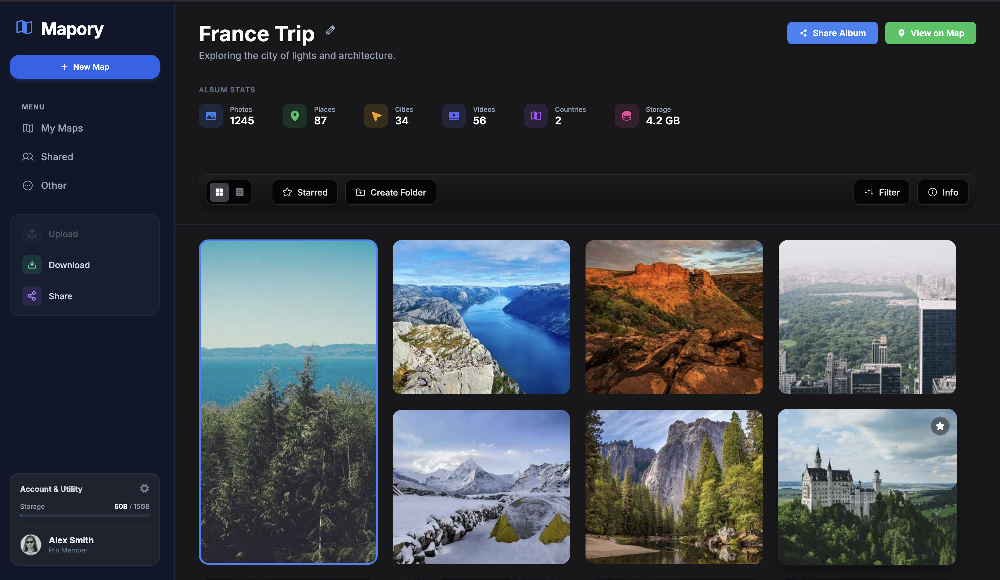
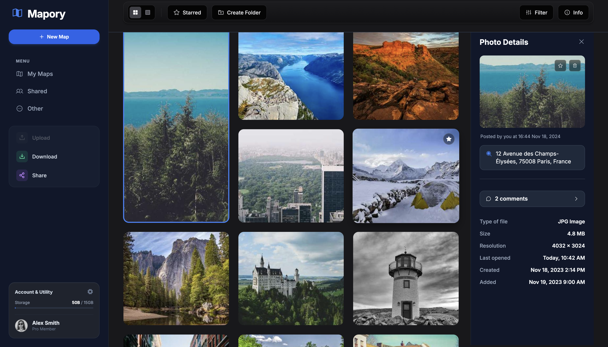
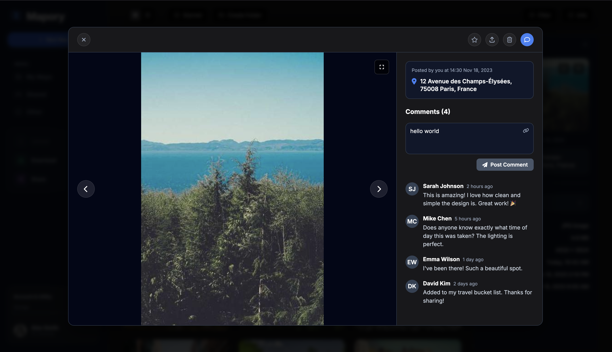
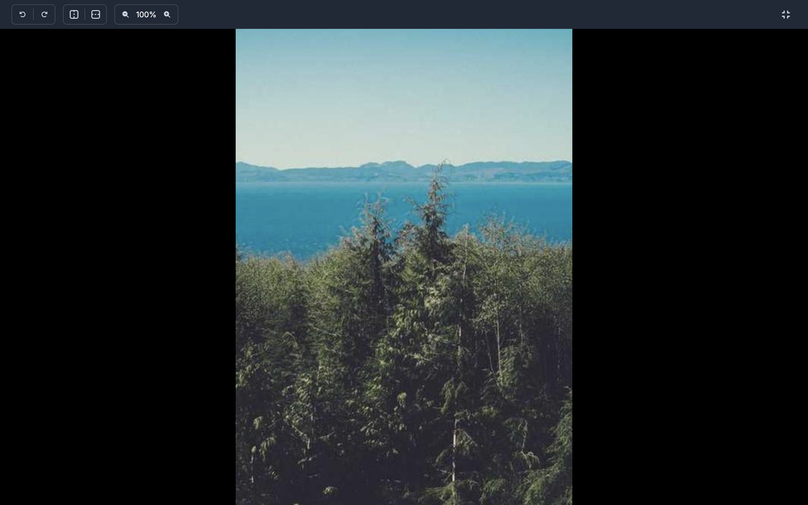
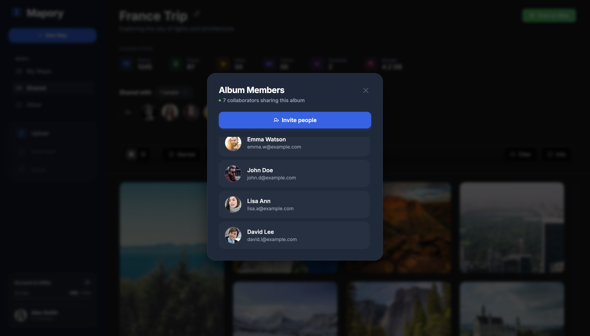
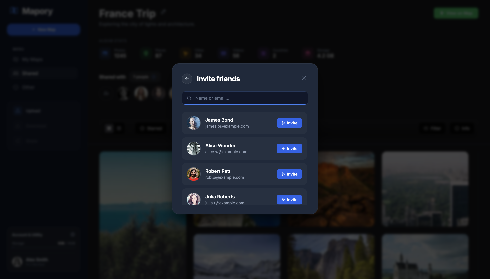

# FrontendPetProject-Mapory

rewrite in .md extention this text: Here is the generalized documentation for **Mapory**, strictly following the structure of the example you provided but adapted to a single-user context (no admins/guests).

---

# Project: Mapory - Personal Travel Journal Interface

**Author:** Anna Nechytailenko

## Background

The main goal is to implement a single-page application that serves as a visual database for travel memories. The application allows the user to browse a specific trip (e.g., "France Trip") and view media in an organized grid layout. The interface is designed to provide quick access to high-level statistics (photos taken, countries visited) while allowing deep dives into specific assets via a detailed sidebar. The application operates as a personal tool for the user to organize, filter, and review their travel experiences without complex role management.

## User Stories

### Visualization & Browsing

* **Story 1:** As a user, I want to see all my travel photos in a responsive masonry grid so I can get a visual overview of the trip.
* **Story 2:** As a user, I want to see immediate statistics (total photos, storage used, cities visited) to understand the scale of the trip.
* **Story 3:** As a user, I want to toggle between different view modes (Grid vs. List) using the toolbar.

### Interaction & Detail

* **Story 4:** As a user, I want to click on a specific photo to open a dedicated information panel (Right Sidebar) without losing my scroll position.
* **Story 5:** As a user, I want to see specific metadata for a selected photo, including file size, resolution, capture date, and the specific address where it was taken.
* **Story 6:** As a user, I want to "Star" specific items to highlight favorites within the collection.

### Organization

* **Story 7:** As a user, I want to filter the visible content (e.g., by date or severity/type) using a sticky toolbar that remains accessible while scrolling.
* **Story 8:** As a user, I want to create folders to better categorize my media assets.

## High-Level Design

### UI Layout

The application features a modern, dark-themed three-column layout:

1. **Navigation Sidebar (Left):**
* Persistent app navigation (My Maps, Shared, Settings).
* "Album Stats" visualization (e.g., Photos count, Storage usage).
* Quick actions (Upload, Download, Share).

2. **Main Content Area (Center):**
* **Header:** Displays the Trip Name and primary actions (Share Album, View on Map).
* **Sticky Toolbar:** A floating control bar containing view switchers, filter buttons, and creation tools. This bar sticks to the top of the viewport when scrolling.
* **Content Grid:** A scrolling masonry layout displaying photo thumbnails.

3. **Detail Sidebar (Right):**
* A dynamic panel that slides in or appears when an item is selected.
* Contains the image preview, "Posted by" timestamps, interactive Location buttons, a visual separator line, and technical metadata (File type, ISO, Size).

## Plan of Attack

* **Project Setup**
* Define color palette (Dark Mode #18181b) and typography (Inter font).
* Integrate Icon library (Phosphor Icons).

* **Layout Implementation**
* Create the Flexbox/Grid structure for the 3-column layout.
* Implement the Left Sidebar with navigation links and account utility cards.

* **Main Feed Development**
* Build the Main Header with Trip Title and action buttons.
* Implement the **Sticky Toolbar** logic  to ensure tools remain visible during scroll.
* Develop the Masonry Grid for responsive photo display.

* **Detail Sidebar Development**
* Create the Right Sidebar container.
* Implement the content hierarchy: Preview Image -> Timestamp -> Location Button -> Separator Line -> Metadata.
* Add CSS transitions for smooth opening/closing states.

## UI

